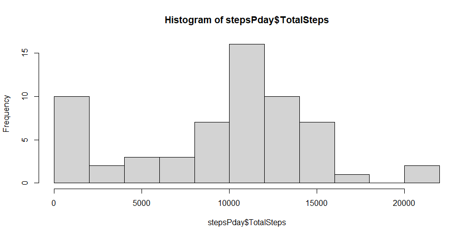
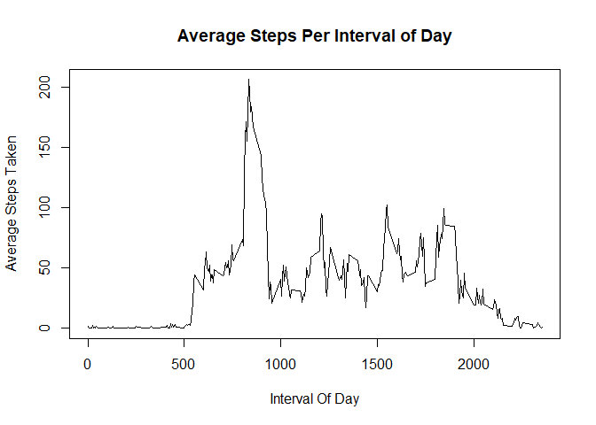
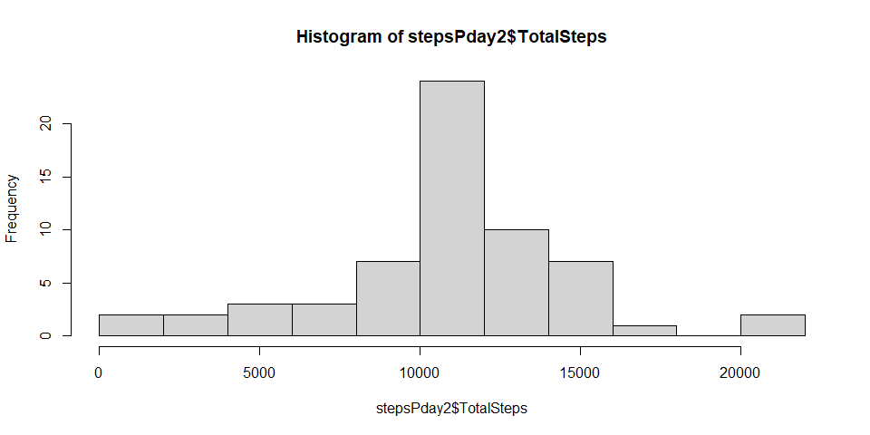
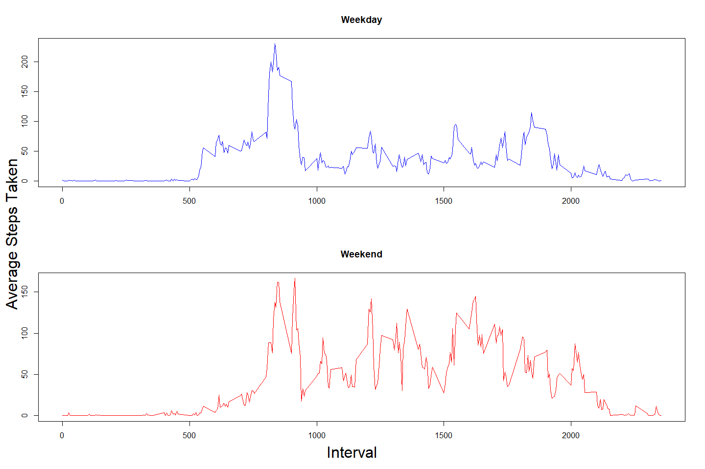

## Introduction
This is Submission for the first Peer Graded Assignment of the Reproducible Research Course. This Project is a fork from [Rpdeng Github](https://github.com/rdpeng/RepData_PeerAssessment1). In this Assignment we are required to perform 5 tasks.  

1. Loading and preprocessing the data
2. What is mean total number of steps taken per day?
3. What is the average daily activity pattern?
4. Imputing missing values
5. Are there differences in activity patterns between weekdays and weekends?

We Are given a Data Set that contains three columns:

1. Date: The Date on which the measurement was made
2. Interval: The 5 minute time interval on which the measurement was made
3. Steps: Number of Steps recorded

### Installing Required Libraries
To start solving the problem we need to load certain packages which we will be using. One of these is the dplyr package required of handling table manipulation. Other packages like base plot and read are loaded by default

``` r
library(dplyr)
```


## Loading and preprocessing the data
To load the data we use the read.csv function on the activity.csv file. We also check the details of the data using the str function.

``` r
data <- read.csv('activity/activity.csv')
str(data)
```

```
## 'data.frame':	17568 obs. of  3 variables:
##  $ steps   : int  NA NA NA NA NA NA NA NA NA NA ...
##  $ date    : chr  "2012-10-01" "2012-10-01" "2012-10-01" "2012-10-01" ...
##  $ interval: int  0 5 10 15 20 25 30 35 40 45 ...
```

Now that we have imported the data, we need to preprocess it, by checking the few rows of the data we can find that the date is a string from the str function. Therefore we need to convert it into a posix object.


``` r
data$date <- as.POSIXct(data$date,format = "%Y-%m-%d")

summary(data)
```

```
##      steps             date               interval     
##  Min.   :  0.00   Min.   :2012-10-01   Min.   :   0.0  
##  1st Qu.:  0.00   1st Qu.:2012-10-16   1st Qu.: 588.8  
##  Median :  0.00   Median :2012-10-31   Median :1177.5  
##  Mean   : 37.38   Mean   :2012-10-31   Mean   :1177.5  
##  3rd Qu.: 12.00   3rd Qu.:2012-11-15   3rd Qu.:1766.2  
##  Max.   :806.00   Max.   :2012-11-30   Max.   :2355.0  
##  NA's   :2304
```

``` r
head(data)
```

```
##   steps       date interval
## 1    NA 2012-10-01        0
## 2    NA 2012-10-01        5
## 3    NA 2012-10-01       10
## 4    NA 2012-10-01       15
## 5    NA 2012-10-01       20
## 6    NA 2012-10-01       25
```


## What is mean total number of steps taken per day?
To find the total number of steps taken per day we need to first combine all the intervals in a day and sum their steps. To perform this we use the group by and the summarise function provided by the dplay package. The group by function combines all the rows with same date while the summarise function sums the step count for each grouped date.


``` r
stepsPday <- data %>% group_by(date)  %>% summarise(TotalSteps = sum(steps,na.rm = TRUE))
head(stepsPday)
```

```
## # A tibble: 6 × 2
##   date                TotalSteps
##   <dttm>                   <int>
## 1 2012-10-01 00:00:00          0
## 2 2012-10-02 00:00:00        126
## 3 2012-10-03 00:00:00      11352
## 4 2012-10-04 00:00:00      12116
## 5 2012-10-05 00:00:00      13294
## 6 2012-10-06 00:00:00      15420
```

Histogram for the above calculated data is draw using the hist function with the frequency mode enabled

``` r
hist(stepsPday$TotalSteps,breaks=10,freq=TRUE)
```

<!-- -->

To find the average number of steps per day we use the mean function. 

``` r
mean(stepsPday$TotalSteps)
```

```
## [1] 9354.23
```
To find the median number of steps per day we use the median function.

``` r
median(stepsPday$TotalSteps)
```

```
## [1] 10395
```


## What is the average daily activity pattern?
To find the daily activity pattern we need to combine the steps taken for all days and segregate them based on interval. To Perform this we use the group by function on the interval column and the summarise the grouped data by taking the mean of steps.

``` r
stepsPint <- data %>% group_by(interval)  %>% summarise(AvgSteps = mean(steps,na.rm = TRUE))
plot(stepsPint$interval,stepsPint$AvgSteps,type='l',
     main = "Average Steps Per Interval of Day",
     xlab = "Interval Of Day",ylab = "Average Steps Taken")
```

<!-- -->

``` r
head(stepsPint)
```

```
## # A tibble: 6 × 2
##   interval AvgSteps
##      <int>    <dbl>
## 1        0   1.72  
## 2        5   0.340 
## 3       10   0.132 
## 4       15   0.151 
## 5       20   0.0755
## 6       25   2.09
```

To find the max average interval we use the max function and then use the filter function to find the interval in which the max value occured.


``` r
maxSteps <- max(stepsPint$AvgSteps)
maxInterval <- stepsPint %>% filter(AvgSteps == maxSteps) %>% select(interval)
maxInterval$interval
```

```
## [1] 835
```

## Imputing missing values
We first find the number missing values in the data.

``` r
NaCount <- sum(is.na(data$steps))
NaCount
```

```
## [1] 2304
```

The NA values are replaced with the average steps found in that particular interval using the mutate function and the match function.

``` r
data2 <- data %>%  mutate(steps=ifelse(is.na(steps), as.integer(stepsPint$AvgSteps[match(interval,stepsPint$interval)]),steps))
head(data2)
```

```
##   steps       date interval
## 1     1 2012-10-01        0
## 2     0 2012-10-01        5
## 3     0 2012-10-01       10
## 4     0 2012-10-01       15
## 5     0 2012-10-01       20
## 6     2 2012-10-01       25
```

The Steps per day data is recaluclated for the new modified data.

``` r
stepsPday2 <- data2 %>% group_by(date)  %>% summarise(TotalSteps = sum(steps,na.rm = TRUE))
head(stepsPday2)
```

```
## # A tibble: 6 × 2
##   date                TotalSteps
##   <dttm>                   <int>
## 1 2012-10-01 00:00:00      10641
## 2 2012-10-02 00:00:00        126
## 3 2012-10-03 00:00:00      11352
## 4 2012-10-04 00:00:00      12116
## 5 2012-10-05 00:00:00      13294
## 6 2012-10-06 00:00:00      15420
```
The histogram for the new data is draw using the hist function, using frequency mode.

``` r
hist(stepsPday2$TotalSteps,breaks=10,freq=TRUE)
```

<!-- -->

The Mean and Median are recalculated for the new data.

``` r
mean(stepsPday2$TotalSteps)
```

```
## [1] 10749.77
```


``` r
median(stepsPday2$TotalSteps)
```

```
## [1] 10641
```

## Are there differences in activity patterns between weekdays and weekends?
To find the day of the week we use the weekdays function and pass it the date as the parameter. It will return the day of the week as string. We then check if the day is a weekday or a weekend and seperate them into different tables.


``` r
data2 <- data2 %>% mutate(day = weekdays(date)) 
weekDayData <- data2 %>% filter(!(day %in% c('Sunday','Saturday')))
weekEndData <- data2 %>% filter(day %in% c('Sunday','Saturday'))
```

We then find the average steps for each interval for each table using the groupby and the summarise functions

``` r
stepsPintWeekDay <- weekDayData %>% group_by(interval) %>%
    summarise(AvgSteps = mean(steps,na.rm = TRUE))
stepsPintWeekEnd <- weekEndData %>% group_by(interval) %>% 
    summarise(AvgSteps = mean(steps,na.rm = TRUE))
```

We plot the Graphs as a single panel using the par function 

``` r
par(mfrow= c(2,1),cex.lab = 0.1)
plot1 <- plot(stepsPintWeekDay$interval,stepsPintWeekDay$AvgSteps,type='l',
     main = "Weekday",xlab="", ylab = "",col='Blue')
plot2 <- plot(stepsPintWeekEnd$interval,stepsPintWeekEnd$AvgSteps,type='l',
     main = "Weekend",xlab = "",ylab = "",col='Red')
mtext("Average Steps Taken", side = 2, line = -2, outer = TRUE,cex=2)
mtext("Interval", side = 1, line = -2, outer = TRUE,cex=2)
```

<!-- -->

## Conclusion

We have performed the necessary tasked asked in the assignment.

Author: Nishaanth
